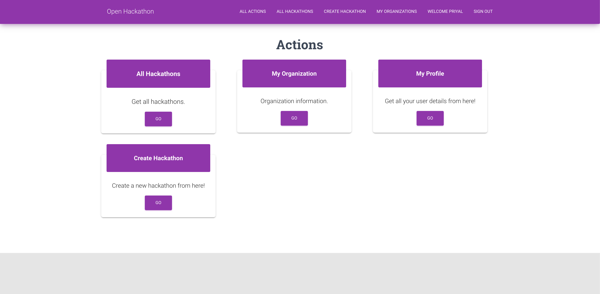

# OpenHackathon

OpenHackathon (http://openhackathon.online:3000) is a free online hackathon management application to create and organize hackathon events. It’s hosted on AWS cloud allowing clients to connect from anywhere. The client app is a web app implemented in Javascript using React and Bootstrap frameworks and uses HTML5 and CSS3. Server is implemented in Java 8 using Spring Boot that uses DI, AOP, MVC, ORM and transactions. The app uses MySQL RDBMS hosted using Amazon RDS.

This repository contains server side (Backend) code for OpenHackathon. The client side (Front end) code is available at "https://github.com/Priyal-08/OpenHackathon_Client".

## How to run the server
1. Download server repo.
2. Run maven update in eclipse
3. Run as Springboot application

## How to run the client
1. Download client repo from https://github.com/Priyal-08/OpenHackathon_Client.
2. Run npm install
3. Run npm start

## Application Screenshots
1. Login View

2. Admin Action Panel

3. All hackathons View

4. Hackathon Details View

5. Team Information View

6. Organization Management View

